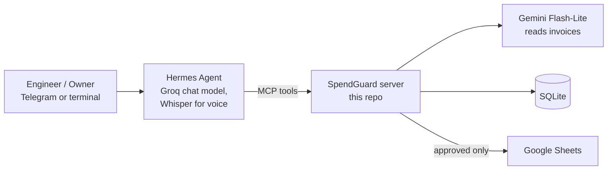

# SpendGuard

**An AI agent that controls SME field spending as it happens, in Egyptian Arabic.**

Site engineers send expense requests the way they already do: a photo of a
handwritten Arabic form, a supplier PDF, or a voice note. SpendGuard reads it,
asks for anything missing, flags duplicates and abnormal supplier prices, and
asks the owner to approve. Approved expenses are logged (SQLite, mirrored to
Google Sheets). The owner can also ask spending questions such as "how much
did we spend on project X this month?". All replies are in Egyptian Arabic.

First pilot: an Egyptian construction company. Built for the "Agents at Work"
hackathon.

## What it catches (demo documents in `data/seed/invoices/`)

| Document | What SpendGuard does |
|---|---|
| `steel_invoice_overpriced.pdf` | ⚠️ Price is 20% above the average of the last 3 purchases → owner decides |
| `sand_transport_form.png` (handwritten) | Reads the handwriting, asks the sender which project it is for |
| `cement_invoice_resubmitted.png` | ⚠️ Invoice SC-1140 was already submitted (now sent by someone else) |
| `blurry_receipt.png` | Asks for a clearer photo instead of guessing the numbers |
| Voice note: "I paid 3000 EGP for sand transport…" | Transcribes it, asks for the date and name, ⚠️ +264% over the usual price |

Only the owner can approve or reject. Every reply is ready-made Egyptian Arabic.

## Quick start (about 5 minutes)

**You need:** Python 3.11+, git, [Hermes Agent](https://hermes-agent.nousresearch.com/docs)
(`hermes --version` works), a free [Gemini API key](https://aistudio.google.com/apikey)
and a free [Groq API key](https://console.groq.com/keys).

```bash
git clone https://github.com/maryamosama33/spendguard-agent.git
cd spendguard-agent
python -m venv venv
venv\Scripts\activate            # macOS/Linux: source venv/bin/activate
pip install -r requirements.txt
copy .env.example .env           # macOS/Linux: cp .env.example .env
```

Edit `.env` and set `GEMINI_API_KEY` and `GROQ_API_KEY` (the rest is optional).
Then, **with the venv active**:

```bash
python scripts/spendguard.py setup     # seeds demo data, installs the "spendguard" Hermes profile
python scripts/spendguard.py chat      # talk to the agent in the terminal
```

Try (one person plays both the site engineer and the owner):

```text
New email from sales@nsf-steel.example with an attached invoice: <full path>\data\seed\invoices\steel_invoice_overpriced.pdf
Reject it, the price is too high
```

Replies take 20-90 s on the free tiers. `python scripts/spendguard.py reset`
restores the demo data between runs.

### Telegram bot (optional)

1. In Telegram, message **@BotFather** → `/newbot`; put the token in `.env` as `TELEGRAM_BOT_TOKEN`.
2. Put your numeric Telegram user ID in `TELEGRAM_ALLOWED_USERS`, `TELEGRAM_HOME_CHANNEL`
   and `SPENDGUARD_OWNER_IDS`. Not sure of it? Message @userinfobot.
   Owners are the only ones who can approve/reject and use the bot's `/` commands;
   other allowed users (site engineers) can submit expenses and ask questions.
3. `python scripts/spendguard.py setup` again, then `python scripts/spendguard.py bot`
   and keep that window open.
4. Send the bot an invoice photo, PDF or voice note.

Someone new? They message the bot, get a pairing code, and you run
`hermes -p spendguard pairing approve telegram <CODE>`.

### Google Sheets (optional)

Without it, approvals are stored in SQLite only, and the reply says the
expense was recorded in the system rather than in the Sheet.
To mirror approved rows to a Sheet, set `GOOGLE_SERVICE_ACCOUNT_FILE` (a
service-account JSON) and `GOOGLE_SHEET_ID`, and share the Sheet with the
service account's email.

## How it works



- **Hermes Agent** runs the conversation and the Telegram gateway, transcribes
  voice notes (Groq Whisper, Arabic) and calls SpendGuard's tools. Its config,
  persona (`hermes/SOUL.md`) and guardrails plugin ship as a Hermes profile in
  `hermes/` and are installed by `scripts/spendguard.py setup`.
- **SpendGuard** (`spendguard/`) is a Python MCP server with 8 tools:
  `extract_expense`, `extract_expense_from_text`, `check_duplicate`,
  `check_price_anomaly`, `save_expense`, `approve_expense`, `reject_expense`,
  `query_expenses`.

Guarantees live in code, not in the prompt, because chat models drift:

- **The owner decides.** `approve_expense` / `reject_expense` need the owner's
  own explicit reply (approve / reject, in Arabic or English) and only act on
  pending expenses. On Telegram, only senders in `SPENDGUARD_OWNER_IDS` may
  decide. The Hermes
  plugin also blocks a decision in the same turn an expense arrives.
- **Never guess.** Missing fields go back to the sender as a question; blurry
  photos are re-requested; `save_expense` refuses incomplete expenses.
- **Warnings always shown.** `save_expense` re-runs the duplicate and price
  checks itself.
- **Exact Egyptian Arabic.** Replies are built in `spendguard/messages.py` and
  delivered verbatim by the plugin.
- **Locked down.** The agent only has SpendGuard's tools; only allowed
  Telegram users get in.

## Free-tier notes

- Groq's free tier allows ~7 complete expenses/day on `qwen/qwen3.8-27b`; Hermes
  then falls back to `openai/gpt-oss-120b` (separate quota).
- Gemini Flash-Lite reads invoices; calls are paced under 4/minute and retried.

## Development

```bash
pytest                                  # 100+ tests, no network needed
python -m spendguard.server             # run the MCP server alone
mcp dev spendguard/server.py            # inspect the tools
```
