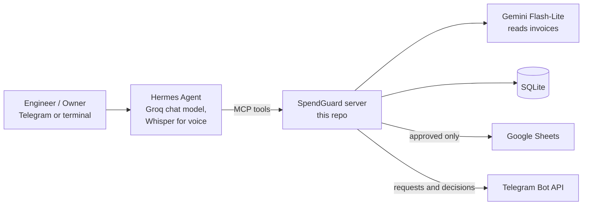

<p align="center">
  
</p>

<h1 align="center">SpendGuard</h1>

<p align="center"><strong>An AI agent that controls SME field spending as it happens, in Egyptian Arabic.</strong></p>

Site engineers send expense requests the way they already do: a photo of a
handwritten Arabic form, a supplier PDF, or a voice note. SpendGuard reads it,
asks for anything missing, flags duplicates and abnormal supplier prices, and
sends the request to the owner for approval. Approved expenses are logged in
SQLite and mirrored to Google Sheets. The owner can also ask spending
questions such as "How much did we spend on project X this month?".

Every reply to users is in Egyptian Arabic. First pilot: an Egyptian
construction company; it fits any business with field spending (maintenance,
supply, logistics, restaurants).

## Contents

- [What it catches](#what-it-catches)
- [Smart features](#smart-features)
- [Quick start](#quick-start-about-5-minutes)
- [Telegram bot](#telegram-bot-optional)
- [Google Sheets](#google-sheets-optional)
- [How it works](#how-it-works)
- [Built-in safeguards](#built-in-safeguards)
- [Free-tier limits](#free-tier-limits)
- [Development](#development)

## What it catches

Demo documents are in `data/seed/invoices/`.

| Document                                          | What SpendGuard does                                                                                       |
| ------------------------------------------------- | ---------------------------------------------------------------------------------------------------------- |
| `steel_invoice_overpriced.pdf`                    | ⚠️ Price per ton is 20% above the last 3 purchases; 💡 suggests a supplier 15% cheaper; 📊 the project would reach 87% of its budget. The owner decides. |
| `sand_transport_form.png` (handwritten)           | Reads the handwriting and asks the sender which project it is for                                          |
| `cement_invoice_resubmitted.png`                  | ⚠️ Invoice SC-1140 was already submitted (now sent by someone else)                                        |
| `blurry_receipt.png`                              | Asks for a clearer photo instead of guessing the numbers                                                   |
| Voice note: "I paid 3000 EGP for sand transport…" | Transcribes it, asks for the date and name, ⚠️ +264% over the usual price                                  |

Prices are compared per unit (ton, trip, bag…), so a bigger order at the usual
price isn't flagged; without a quantity, invoice totals are compared. Only the
owner can approve or reject.

## Smart features

**Cheaper supplier suggestions.** When another supplier recently sold the same
item at least 5% cheaper per unit, the approval request says so, e.g.
"Cheaper supplier: Delta Steel Group, average EGP 15,267 per ton (15.2%
cheaper)."

**Savings report.** The owner asks "How much did we save this month?" and gets
the money their rejections saved. A rejected duplicate counts in full; a
rejected overpriced request counts only the overcharge (18,000 at +20% saved
3,000). Example reply: "In October 2026 SpendGuard saved you EGP 4,220: one
duplicate invoice rejected (EGP 1,220) and one price increase rejected
(EGP 3,000 overcharge)."

**Project budgets.** Each project's budget is in `data/seed/budgets.json`.
When approving a request would take its project to 80% of the budget or past
it, the approval request says so, e.g. "If you approve, Fifth Settlement
Villas will have spent 87% of its budget (65,470 of EGP 75,000), EGP 9,530
left." The owner can ask "How much is left in the budget?" for one project
or all of them. Spend counts approved expenses only.

**Learns from the owner's decisions.** The price baseline already follows
approved prices. On top of that, SpendGuard learns how strict the owner is
about each item, and tells them what it learned:

- **Stricter:** the owner rejects an increase SpendGuard didn't flag, because
  of the price (e.g. sand transport at +4.5%, "the price is too high"). From
  then on, that item is flagged above 3%.
- **Quieter:** the owner approves two flagged increases in a row (e.g. steel
  at +20% twice). From then on, that item is flagged only above 25%.

Learning uses no extra AI calls: thresholds are replayed from the decision
history (`spendguard/learning.py`), so they survive restarts, and `reset`
clears them.

## Quick start (about 5 minutes)

**You need:** Python 3.11+ (tested on 3.11 and 3.14), git,
[Hermes Agent](https://hermes-agent.nousresearch.com/docs) (`hermes --version`
works), a free [Gemini API key](https://aistudio.google.com/apikey) and a free
[Groq API key](https://console.groq.com/keys).

```bash
git clone https://github.com/maryamosama33/spendguard-agent.git
cd spendguard-agent
python -m venv venv
venv\Scripts\activate            # macOS/Linux: source venv/bin/activate
pip install -r requirements.txt
copy .env.example .env           # macOS/Linux: cp .env.example .env
```

Edit `.env` and set `GEMINI_API_KEY` and `GROQ_API_KEY` (the rest is optional).
Then, **with the venv active**, in a regular terminal window (PowerShell, cmd
or a macOS/Linux terminal):

```bash
python scripts/spendguard.py setup     # loads demo data, installs the "spendguard" Hermes profile
python scripts/spendguard.py chat      # talk to the agent in the terminal
```

Try this (one person plays both the site engineer and the owner):

```text
New email from sales@nsf-steel.example with an attached invoice: <full path>\data\seed\invoices\steel_invoice_overpriced.pdf
Reject it, the price is too high
How much did we save this month?
```

- **Your own invoice:** copy it (pdf, jpg, png or webp) into
  `data/seed/invoices/` first. SpendGuard only reads files sent in the chat or
  placed there, so nobody can talk the agent into reading other files.
- **Start over:** `python scripts/spendguard.py reset` restores the demo data.

## Telegram bot (optional)

1. In Telegram, message **@BotFather**, send `/newbot`, and put the token in
   `.env` as `TELEGRAM_BOT_TOKEN`.
2. Find numeric Telegram user IDs by messaging **@userinfobot** from each
   account. In `.env`:
   - `SPENDGUARD_OWNER_IDS`: the owner (only owners can approve, reject and
     use the bot's `/` commands)
   - `TELEGRAM_ALLOWED_USERS`: the owner and the site engineers, comma-separated
   - `TELEGRAM_HOME_CHANNEL`: the owner's ID
3. Run `python scripts/spendguard.py setup` again, then
   `python scripts/spendguard.py bot`, and keep that window open.
4. The owner and each engineer send the bot `/start` once (a bot can only
   message people who have messaged it).
5. An engineer sends an invoice photo, PDF or voice note. The approval request,
   with the invoice attached, goes to the owner's own chat. The owner replies
   "approve" or "reject" with a reason (in Arabic or English), and the engineer
   is told the decision. If the owner submits an expense themselves, it is
   answered in their own chat.

New engineer? They message the bot, get a pairing code, and you run
`hermes -p spendguard pairing approve telegram <CODE>`.

## Google Sheets (optional)

Without it, approved expenses are stored in SQLite only, and the reply says the
expense was recorded in the system rather than in the Sheet. To mirror approved
rows to a Sheet, set `GOOGLE_SERVICE_ACCOUNT_FILE` (a service-account JSON
file) and `GOOGLE_SHEET_ID` in `.env`, and share the Sheet with the service
account's email.

## How it works



- **Hermes Agent** runs the conversation and the Telegram gateway, transcribes
  voice notes (Groq Whisper, Arabic) and calls SpendGuard's tools. Its config,
  persona (`hermes/SOUL.md`) and guardrails plugin ship as a Hermes profile in
  `hermes/`, installed by `scripts/spendguard.py setup`.
- **SpendGuard** (`spendguard/`) is a Python MCP server with 10 tools:
  `extract_expense`, `extract_expense_from_text`, `check_duplicate`,
  `check_price_anomaly`, `save_expense`, `approve_expense`, `reject_expense`,
  `query_expenses`, `savings_report`, `budget_report`.

## Built-in safeguards

These live in code, not only in the prompt, because chat models drift:

- **The owner decides.** Approving or rejecting needs the owner's own explicit
  reply and only acts on pending requests. On Telegram, only users in
  `SPENDGUARD_OWNER_IDS` can decide. A decision can't happen in the same turn
  an expense arrives. If several requests are pending, the owner is asked which
  one.
- **Never guess.** Missing fields go back to the sender as a question, blurry
  photos are re-requested, and incomplete expenses are never saved.
- **Warnings always shown.** Saving re-runs the duplicate and price checks.
- **Exact Egyptian Arabic.** Replies are built in `spendguard/messages.py` and
  delivered word for word by the Hermes plugin.
- **Locked down.** The agent has only SpendGuard's tools, only allowed Telegram
  users get in, and only invoice files from the chat or `data/seed/` are read.
- **Audit trail.** Each request keeps a copy of its original document in
  `data/documents/`.

## Free-tier limits

- **Groq (chat model):** about 7,000 tokens per minute, and each step of an
  expense uses about 6,000. On Telegram, one expense takes about 1–3 minutes;
  send one message at a time. About 7 complete expenses per day run on
  `qwen/qwen3.8-27b`, then Hermes falls back to `openai/gpt-oss-120b`
  (separate quota).
- **Gemini Flash-Lite (invoice reading):** calls are paced under 4 per minute
  and retried automatically.

## Development

```bash
pytest                                  # 200+ tests, no network needed
python -m spendguard.server             # run the MCP server alone
mcp dev spendguard/server.py            # inspect the tools
```

Dependencies are pinned in `requirements.txt` to the tested versions.
